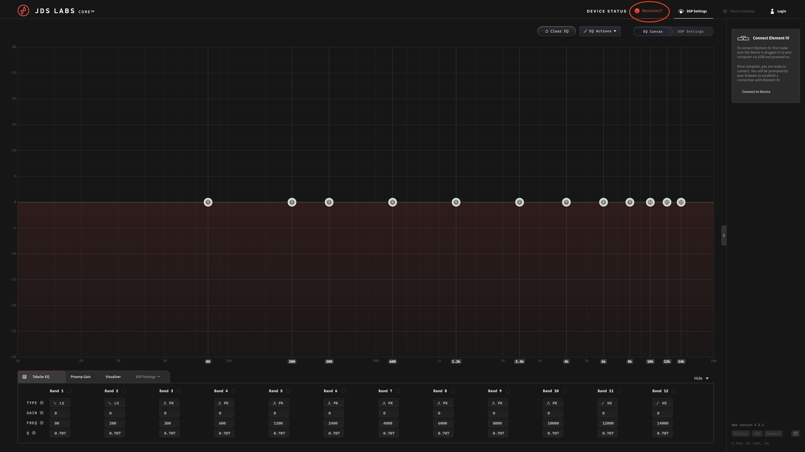
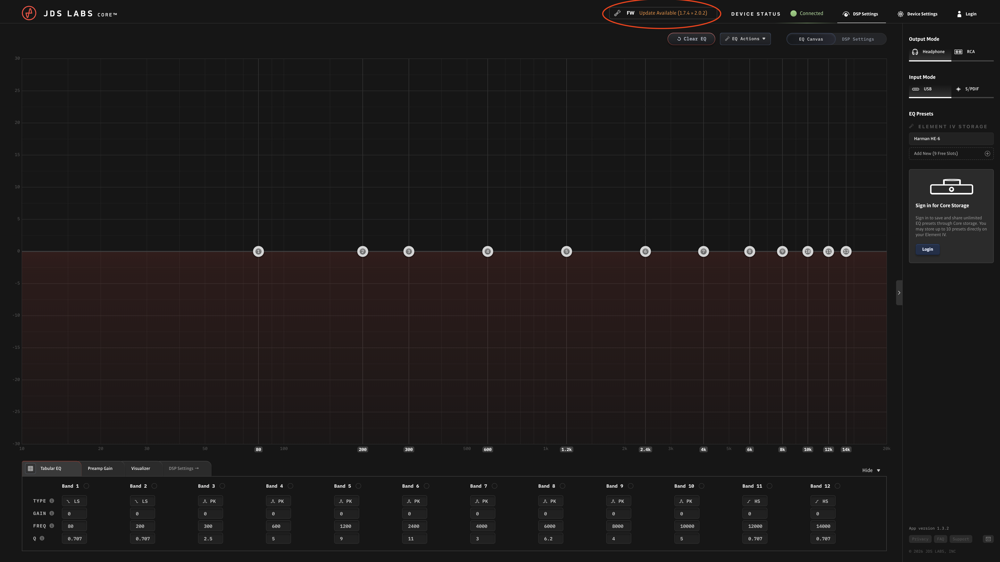
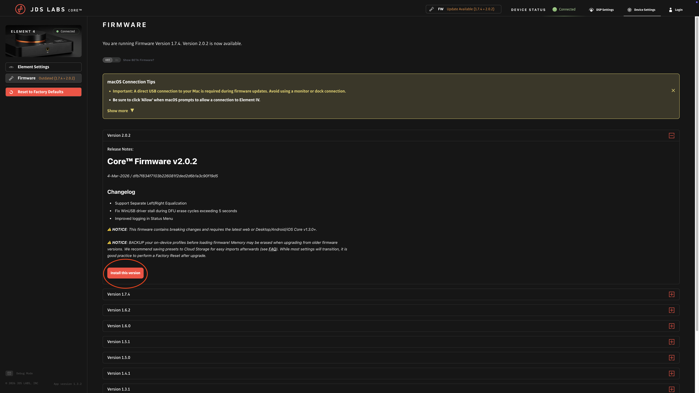

# Firmware Update

Update your Element IV firmware using the Core™ web app.

**Difficulty:** Easy  
**Time:** 10 minutes  
**Tools:** USB-C cable, Chrome or Edge browser

---

  

    
  

  

    

      1
      <h3 class="repair-step-title">Connect Element IV</h3>
    

    <ul>
      <li>Connect Element IV to your computer via USB-C</li>
      <li>Ensure the device is powered on</li>
      <li>Wait a few seconds for your computer to recognize it</li>
    </ul>
  

  

    
  

  

    

      2
      <h3 class="repair-step-title">Open Core™</h3>
    

    <ul>
      <li>Open <strong>Chrome</strong> or <strong>Edge</strong> browser</li>
      <li>Navigate to <a href="https://core.jdslabs.com" target="_blank">core.jdslabs.com</a></li>
    </ul>
    

      Core™ requires a Chromium-based browser (Chrome, Edge, Brave) for USB connectivity. Safari and Firefox are not supported.
    

  

  

    
  

  

    

      3
      <h3 class="repair-step-title">Connect Device</h3>
    

    <ul>
      <li>Click <strong>Connect Device</strong> in Core™</li>
      <li>Select "Element IV" from the browser's device list</li>
      <li>Click <strong>Connect</strong></li>
    </ul>
  

  

    
  

  

    

      4
      <h3 class="repair-step-title">Check for Updates</h3>
    

    <ul>
      <li>Navigate to <strong>Settings → Firmware</strong></li>
      <li>Core™ will display your current firmware version</li>
      <li>If an update is available, you'll see an <strong>Update</strong> button</li>
    </ul>
  

  

    
  

  

    

      5
      <h3 class="repair-step-title">Install Update</h3>
    

    <ul>
      <li>Click <strong>Update Firmware</strong></li>
      <li>Wait for the update to complete (1-2 minutes)</li>
      <li>Element IV will restart automatically when finished</li>
    </ul>
    

      Do not disconnect USB or power during the update. Interrupting the process may require recovery steps.
    

  

  

    
  

  

    

      6
      <h3 class="repair-step-title">Verify</h3>
    

    <ul>
      <li>After restart, reconnect to Core™</li>
      <li>Go to <strong>Settings → Firmware</strong> to confirm the new version</li>
      <li>Test basic functions (volume, output toggle, EQ)</li>
    </ul>
  

---

## Troubleshooting

**Device not detected?**
- Try a different USB cable
- Connect directly to your computer (not through a hub)
- Restart your browser and try again

**Update failed?**
1. Power cycle Element IV (unplug power, wait 10 seconds, reconnect)
2. Reconnect USB
3. Try the update again

If problems persist, contact [JDS Labs Support](https://jdslabs.com/support).

## Release Notes

Visit the [JDS Labs Blog](https://blog.jdslabs.com) for detailed firmware release notes.
